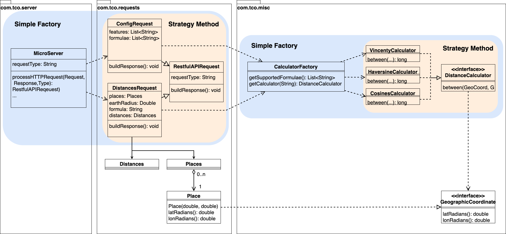
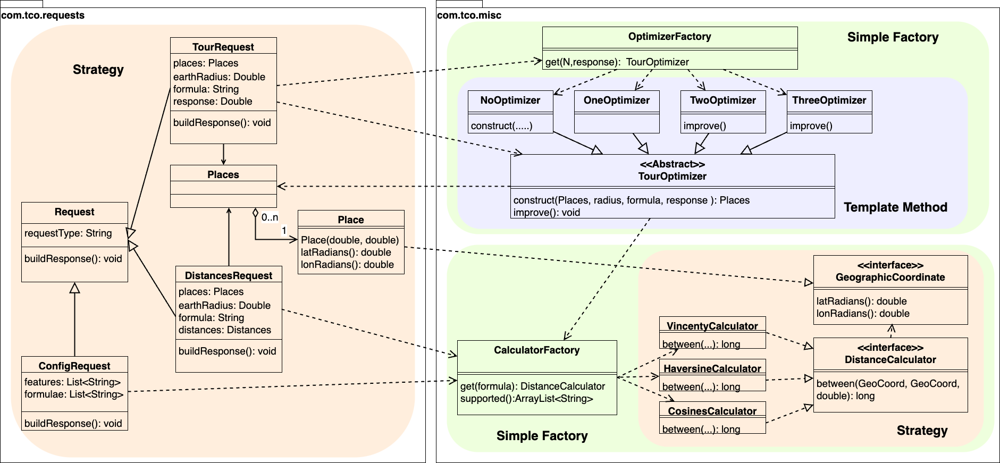
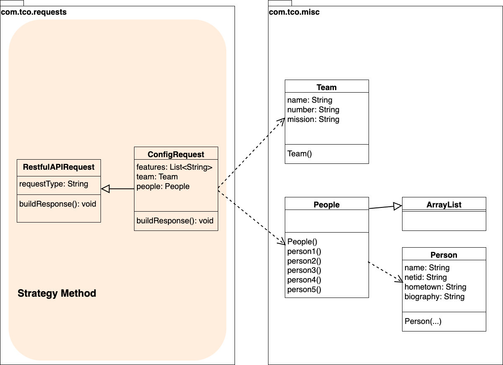

# Trip Co-Optimizer


A REST API for planning trips. Given a list of places, it calculates the great-circle distances between them, builds a short round-trip tour, and searches airport and city data by name or proximity. It was built by a five-person team ("Gold Rushers") over a semester of two-week sprints in CS314 Software Engineering at Colorado State University (Fall 2025).

## Features

| Endpoint | What it does |
| --- | --- |
| `POST /distances` | Leg distances between consecutive places, using the Vincenty, Haversine, or spherical law of cosines formula, for any earth radius |
| `POST /tour` | Reorders places into a shorter round trip with nearest-neighbor construction, trying each starting place within a client-supplied time limit |
| `POST /near` | Airports or cities within a given distance of a point |
| `POST /find` | Airports or cities whose name, region, or country matches a search string |
| `POST /config` | Server capabilities and supported features |

Every request and response is validated against a JSON Schema in [server/src/main/resources/schemas](server/src/main/resources/schemas).

## Tech stack

Java 11, Spark Java, Gson, Maven, MariaDB (airports), MongoDB (cities), everit JSON Schema, JUnit 5 with JaCoCo coverage, and Postman/Newman for API tests.

## Repository layout

```
server/src/main/java/com/tco/
  requests/   one class per endpoint (DistancesRequest, TourRequest, ...)
  misc/       distance calculators, tour optimizers, data sources, JSON validation
  server/     Spark web server setup and routing
server/src/test/   JUnit tests
Postman/           API test collections
images/            UML diagrams
```

## Design

| Distances | Tour | Config |
| --- | --- | --- |
|  |  |  |
